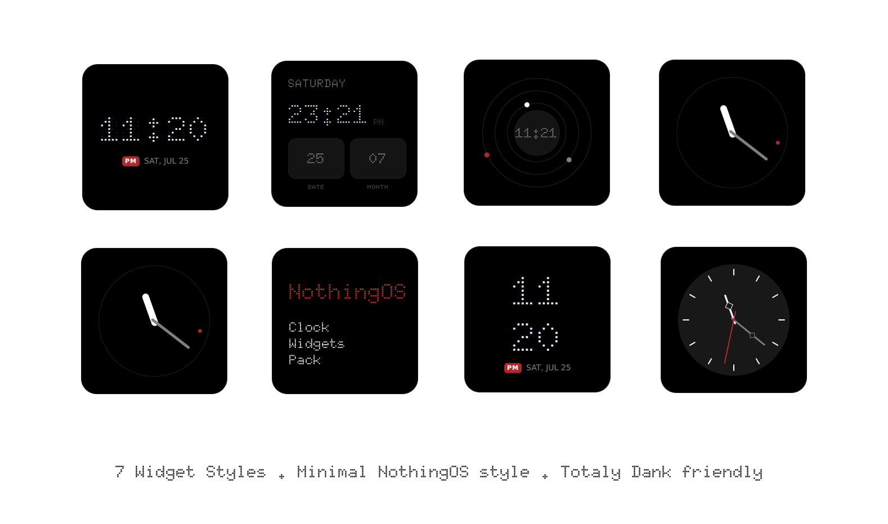

<div align="center">



# Nothing Clock

A clean, Nothing OS–inspired clock for your desktop.

  

Built for [DankMaterialShell](https://github.com/AvengeMedia/DankMaterialShell)

</div>

---

Nothing Clock brings the dot-matrix look of Nothing OS to your desktop — six different clock faces, fully customizable, so you can find the one that fits your setup.

## 📦 Installation


```dms plugins install nothingClock```


## ✨ Styles

Pick whichever look suits your desktop best, right from the widget's settings.

| Style | What it looks like |
|---|---|
| **Digital** | Classic dot-matrix `HH:MM`, with a softly blinking colon. |
| **Split** | Hour and minute stacked as two large lines, for a bold, oversized look. |
| **Analog** | A minimal dial — clean white hour hand, grey minute hand, and a red seconds dot gliding around the rim. |
| **Analog (Classic)** | A more traditional watch face, with hour markers and slim diamond-cut hands. |
| **Stacks** | Day of the week and time up top, with the date and month laid out as separate cards below. |
| **Orbit** | Three quiet concentric rings, each carrying a dot that traces the hour, minute, and second. |


## ✅ Requirements

- DankMaterialShell `1.2.0` or newer

## 💬 Feedback

Found a bug or have an idea for a new style? Feel free to open an issue — this widget is actively maintained and improvements are always welcome.

## 🙌 Credits

Made by **HeX** ([@samgrande](https://github.com/samgrande))

## 📄 License

Released under the [MIT License](LICENSE).
